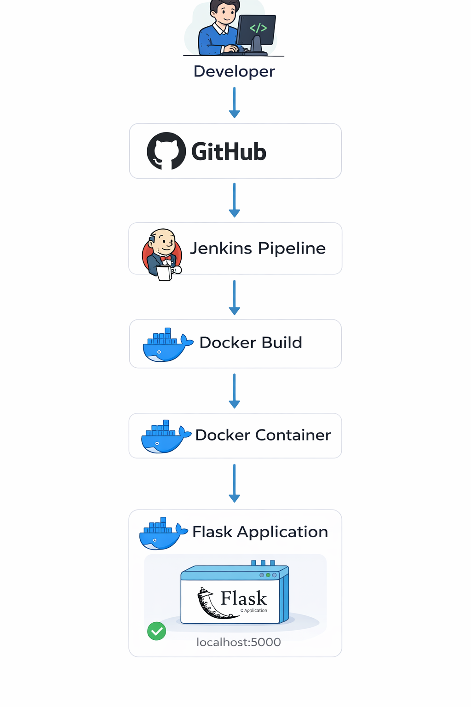
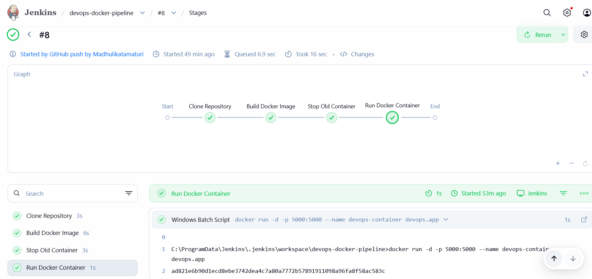
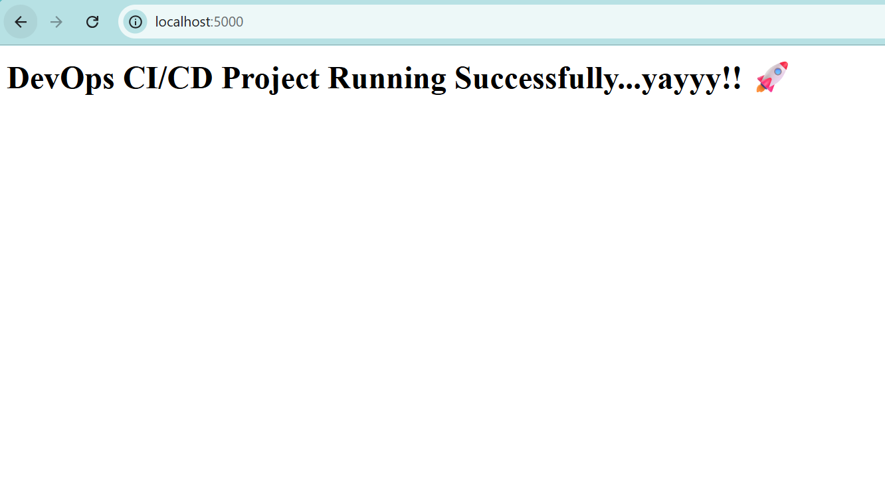

# DevOps CI/CD Pipeline using Jenkins & Docker 🚀

This project demonstrates a complete CI/CD pipeline that automatically builds and deploys a containerized Flask application using Jenkins and Docker. Whenever code is pushed to GitHub, Jenkins triggers a pipeline that builds the Docker image and deploys the application.

---

## Technologies Used

* Python (Flask)
* Docker
* Jenkins
* GitHub
* Ngrok
* Git
* VS Code

---

## Project Architecture

## Project Architecture

  

## CI/CD Workflow

The pipeline follows these steps:

1. Developer pushes code to GitHub.
2. GitHub webhook triggers Jenkins pipeline.
3. Jenkins clones the repository.
4. Jenkins builds a Docker image.
5. Jenkins stops any running container.
6. Jenkins deploys a new Docker container.
7. The Flask application runs on **localhost:5000**.

### Workflow

Developer pushes code to GitHub
↓
GitHub Webhook triggers Jenkins
↓
Jenkins Pipeline executes
↓
Docker builds new image
↓
Old container is stopped
↓
New container is deployed
↓
Application runs on **localhost:5000**

---

## Project Structure

devops-ci-cd-project
│
├── app.py
├── Dockerfile
├── requirements.txt
├── Jenkinsfile
├── README.md
└── images

---

## CI/CD Pipeline Stages

### 1. Clone Repository

Jenkins pulls the latest code from the GitHub repository.

### 2. Build Docker Image

A Docker image is built using the Dockerfile.

### 3. Stop Existing Container

If a previous container is running, Jenkins stops and removes it.

### 4. Deploy Container

A new Docker container is launched with the updated application.

---

## Docker Configuration

The Dockerfile defines the container environment.

Steps performed during the build:

* Pull Python base image
* Set working directory
* Install dependencies
* Copy application files
* Run Flask application

---

## Jenkins Pipeline

## Jenkins Pipeline

  

The Jenkins pipeline automates the build and deployment process using predefined stages.

Example pipeline flow:

GitHub Push
↓
Webhook Trigger
↓
Jenkins Pipeline Execution
↓
Docker Build
↓
Docker Deployment

## Docker Container Deployment

The Jenkins pipeline builds the Docker image and deploys the application container automatically.

  

---

## Application Output

After a successful build, the application becomes accessible at:

http://localhost:5000

## Application Output

  

---

## Setup Instructions

### 1. Clone the Repository

git clone https://github.com/your-username/devops-ci-cd-project.git

cd devops-ci-cd-project

### 2. Install Docker

Download Docker Desktop and verify installation:

docker --version

### 3. Install Jenkins

Download Jenkins and open:

http://localhost:8080

Complete initial setup and install suggested plugins.

### 4. Configure Pipeline

Create a Jenkins pipeline job and connect it with the GitHub repository.

### 5. Configure Webhook

Add a webhook in GitHub using the ngrok public URL:

https://your-ngrok-url/github-webhook/

---

## Key DevOps Concepts Demonstrated

* Continuous Integration
* Continuous Deployment
* Containerization using Docker
* Pipeline Automation using Jenkins
* Webhook-based automation
* Infrastructure as Code practices

---

## Future Improvements

Possible enhancements include:

* Deploying the application to AWS or another cloud platform
* Adding automated testing in the pipeline
* Implementing monitoring and logging tools
* Using Kubernetes for container orchestration

---

## Conclusion

This project demonstrates how DevOps tools such as Jenkins and Docker can be integrated to automate the application build and deployment process. By implementing a CI/CD pipeline, developers can ensure faster and more reliable software delivery.
